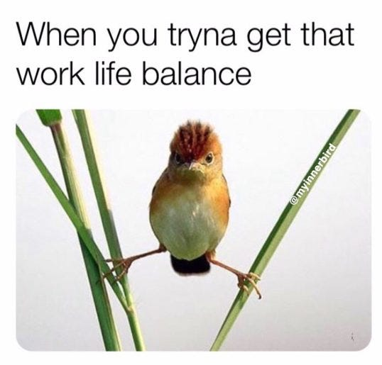
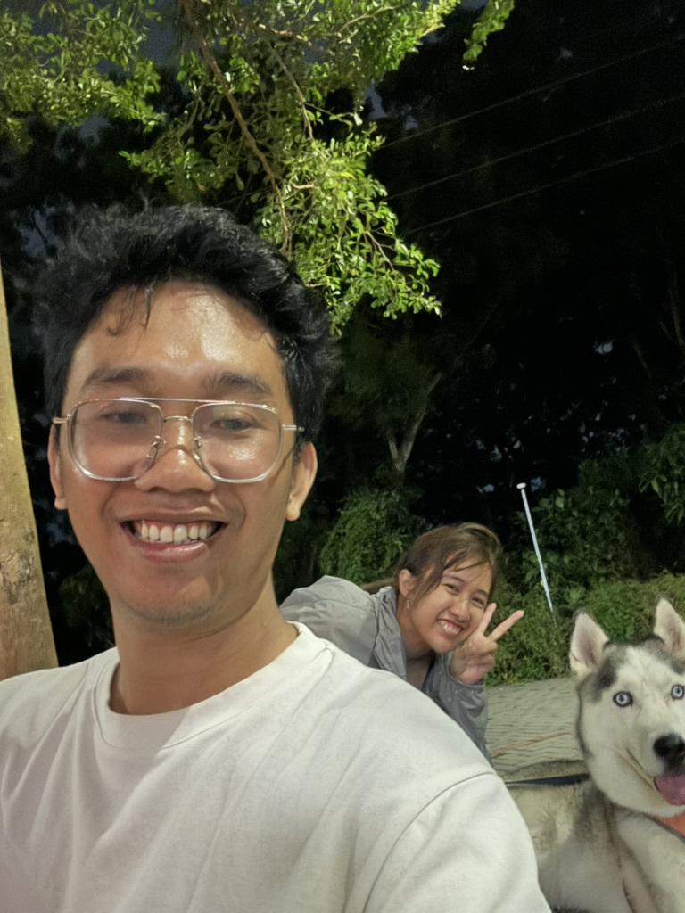
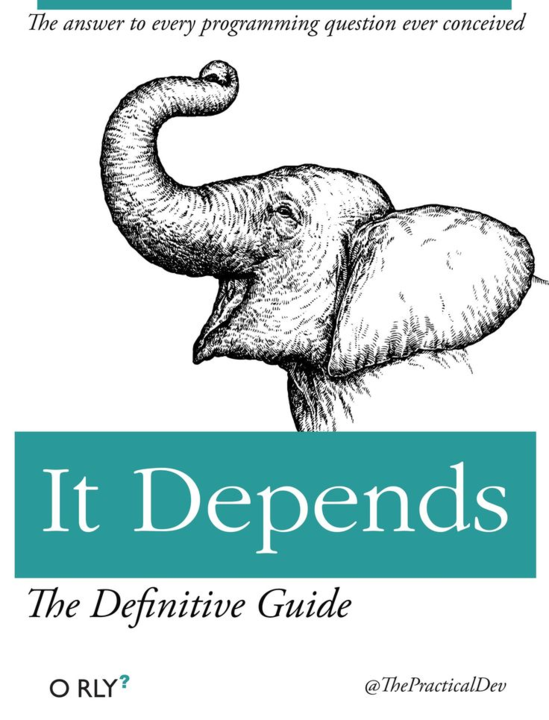
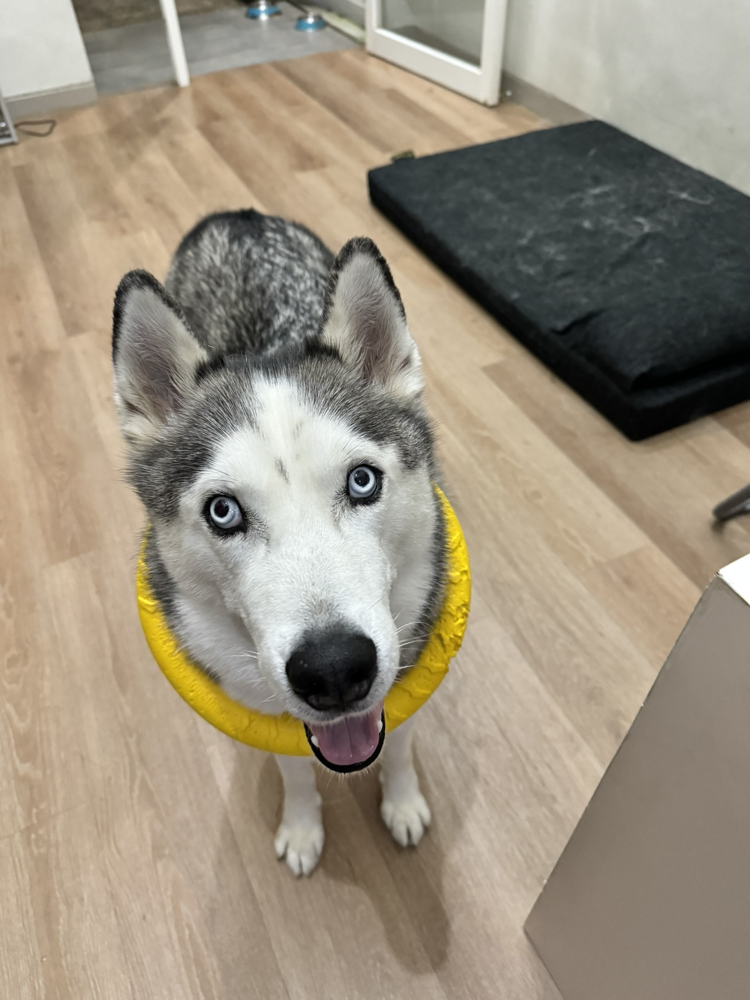

+++
title =  "Work-Life Balance. What is it?"
date = "2025-02-22"
tags = ["personal", "life", "self-improvement"]
+++

---

### "Work-Life Balance" – What’s the Deal?

We have been hearing from many people before who said "Work-Life balance" is really important to consider when you are looking for a job. But what is work life balance actually? Before we go throught that we might need to look back to history first.

---

### A Quick History Lesson ⏳

Before we have what we have right now, which is 8 hours working hours, we usually have working hours from 10-16 working hours. And then in the early 19th century, [Robert Owen coined the slogan](https://en.wikipedia.org/wiki/Eight-hour_day_movement) *"Eight hours' labour, Eight hours' recreation, Eight hours' rest"*.

Fast forward to today – most countries (including Indonesia, though we joined the party a bit later) adopted the 8 hours workday (or 40 hours workweek). In theory this seems perfect, we only have 24 hours a day so we have to split it to 3 section, so we can effectively use most of our day.

*Or is it?*

---

### When Theory Meets Reality 🚗💨

Here’s the catch:
- Does your 1-hour commute count as "recreation"?
- Is binge-watching Netflix the same as "self-improvement"?
- What if you *enjoy* learning work-related tech after hours?

The 8-hour rule feels like trying to fit a PS5 into a Nintendo Switch case – messy and slightly unrealistic.

---

### My confessions 😅

When I was younger (and I’m not saying I’m ancient!), I usually doing work for more than 8 hours. In some days I even work for more than 12 hours a day. Do I regret it because it is not work life balance? Of course not. In fact I think, that is helping me to shape what I am right now.

Those chaotic years actually *taught* me balance. Now I:
- ✅ Deliver better work in less time
- ✅ Can afford to treat my parents to dinner
- ✅ Still geek out on side projects (*when I want to*)
- ✅ Still have time to spend with my wife and my dog

---
### The Unpopular Truth About Balance ⚖️

So what is actually work life balance? As a senior engineer, I want to say "It depends"

**Work-life balance isn’t a rulebook – it’s a rhythm.**
- Employers: Respect the 8-hour spirit
- Employees: Speak up when deadlines are wild
- Everyone: **Burnout isn’t a badge of honor**

Your balance might look like:
- 🌴 Taking a tech-free vacation
- 🎮 Spending weekends playing game or doing some hobby porject
- 📚 Learning Rust "just because"
- 🐶 Actually petting your dog instead of just posting dog memes

---

### You’re the DJ of Your Life 🎧

At the end of the day, *you* control the playlist. Want to grind hard now to coast later? Go for it. Need to unplug completely every weekend? Do it. Balance isn’t about perfect splits – it’s about designing a life that doesn’t make you dread Mondays.

*Now if you’ll excuse me, my dog is judging me for staring at this screen too long.*

