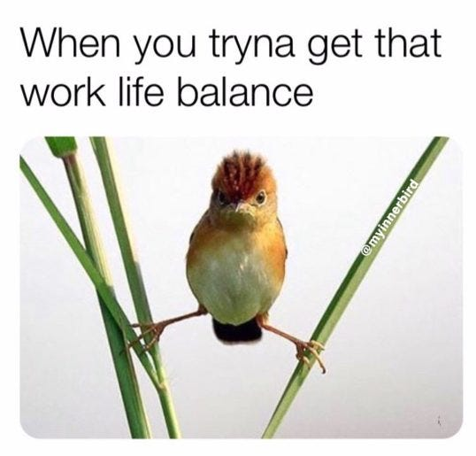
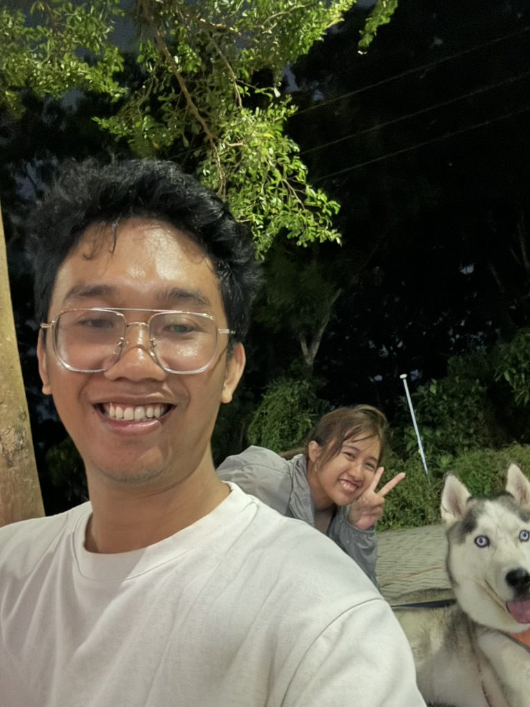

+++
title =  "Work-Life Balance. Apakah itu?"
date = "2025-02-22"
tags = ["personal", "life", "self-improvement", "pengembangan-diri"]
+++

---

### "Work-Life Balance" – Mitos atau Nyata?

Kita sering dengar orang bilang "work-life balance" itu penting banget saat cari kerja. Tapi sebenernya, apa sih work-life balance itu? Sebelum kita bahas lebih jauh, mungkin kita perlu lihat dulu sejarahnya.

---

### Kilas Balik Sejarah ⏳

Sebelum kita memiliki jam kerja 8 jam seperti saat ini, kerja 10-16 jam sehari itu hal biasa. Lalu, di awal abad ke-19, [Robert Owen mencetuskan slogan](https://id.wikipedia.org/wiki/Delapan_jam_kerja_sehari) *"Delapan jam kerja, delapan jam rekreasi, delapan jam istirahat"*.

Lompat ke sekarang ini – kebanyakan negara (termasuk Indonesia) udah pakai sistem kerja 8 jam perhari (40 jam per minggu). Secara teori ini keliatan sempurna, kita cuma punya 24 jam sehari jadi kita bisa membaginya menjadi 3 bagian, sehingga kita bisa efektif dalam bekerja dan istirahat.

*Atau iya nggak sih?*

---

### Ketika Teori Bertemu Kenyataan 🚗💨

Nah, ini masalahnya:
- Apakah perjalanan 1 jam ke kantor itu termasuk "rekreasi"?
- Apakah nonton Netflix sama dengan "self-improvement"?
- Gimana kalau kamu *menikmati* belajar teknologi terkait pekerjaan di luar jam kerja?

Aturan 8 jam itu kayak kita mencoba untuk masukin PS5 ke dalam casing Nintendo Switch – berantakan dan agak nggak realistis.

---

### Pengakuan Saya 😅

Waktu saya masih muda (dan saya nggak bilang saya tua ya!), saya sering kerja lebih dari 8 jam. Bahkan kadang sampai lebih dari 12 jam sehari. Apa saya menyesal karena itu nggak seimbang? Tentu nggak. Malah, saya rasa itu membantu membentuk diri saya seperti sekarang.

Di waktu-waktu tersebut justru *mengajarkan* saya tentang keseimbangan. Sekarang saya:
- ✅ Bisa kerja lebih baik dalam waktu yang lebih singkat
- ✅ Bisa traktir orang tua makan malam
- ✅ Masih bisa ngerjain proyek sampingan (*kalau mau*)
- ✅ Masih punya waktu buat istri dan anjing saya

---
### Kebenaran yang Nggak Populer Tentang Keseimbangan ⚖️

Jadi, apa sih sebenernya work-life balance itu? Sebagai seorang engineer, saya mau bilang "Tergantung"

**Work-life balance bukan buku aturan – tapi ritme.**
- Perusahaan: Hormati semangat 8 jam kerja
- Karyawan: Berani bilang kalau deadline nggak masuk akal
- Semua orang: **Burnout bukan tanda kehormatan**

Keseimbangan kamu mungkin terlihat seperti:
- 🌴 Liburan tanpa gadget
- 🎮 Main game atau ngerjain proyek hobi di akhir pekan
- 📚 Belajar Rust "sekadar iseng"
- 🐶 Bermain dengan hewan peliharaan, bukan cuma posting *meme* hewan peliharaan

---

### Kamu adalah DJ Kehidupan Kamu 🎧

Pada akhirnya, *kamu* yang ngontrol playlist hidup kamu. Mau kerja keras sekarang buat santai nanti? Silakan. Mau istirahat setiap *weekend*? Lakukan aja. Keseimbangan bukan tentang pembagian waktu yang sempurna – tapi tentang merancang hidup yang nggak bikin kamu benci hari Senin.

*Nah, kalau nggak keberatan saya mau pamit dulu, anjing saya lagi ngeliatin saya karena kelamaan nongkrongin layar ini.*

